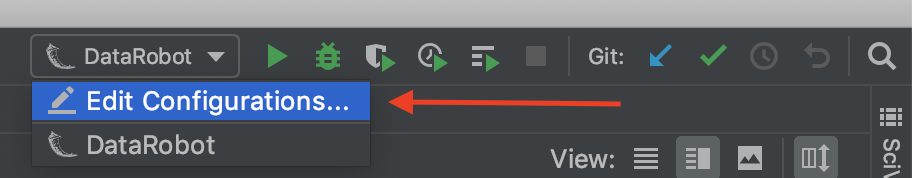
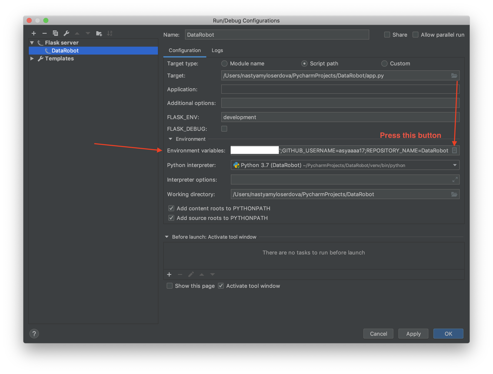
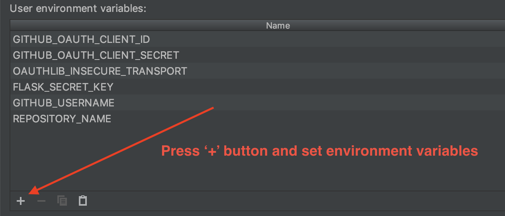
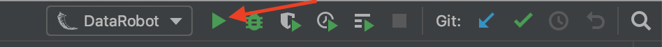

# Data Robot self-replication app

**Step 1:**
- Firstly, you should visit the following link to register a new OAuth application: 
https://github.com/settings/applications/new
- There are 3 required fields: Application name, Homepage URL and Authorization callback URL.
- _Application name_ - you can fill this field with any app name you want.
- _Homepage URL_ - when you use application locally you fill this field with the following link - http://127.0.0.1:5000.
In production you use another link: https://APPNAME.herokuapp.com. APPNAME - is your application name from Heroku. E.g.
for our application the APPNAME is _datarobotest_, https://datarobotest.herokuapp.com.
- _Authorization callback URL_ - when you use application locally you fill this field with the following link - 
http://127.0.0.1:5000/login/github/authorized.
In production you use another link: https://APPNAME.herokuapp.com/login/github/authorized.
- Register your application.

**Step 2:**
 - Run the following commands on your computer:

`git clone https://github.com/asyaaaa17/DataRobot.git`

`cd DataRobot`

`pip3 install virtualenv`

`python3 -m venv venv`

`. venv/bin/activate`

`pip3 install -r requirements.txt`

 - Create **.env** file fill it with the environment variables, which are represented in **.env.sample** file.
 
 --OR-- 
 - If you are using PyCharm you can set the environment variables in Run/Debug Configurations
 
 
 
 
 **GITHUB_OAUTH_CLIENT_ID**=YOU_SHOULD_INSERT_YOUR_VALUE_HERE
 **GITHUB_OAUTH_CLIENT_SECRET**=YOU_SHOULD_INSERT_YOUR_VALUE_HERE
 **OAUTHLIB_INSECURE_TRANSPORT**=true
 
 **FLASK_SECRET_KEY**=YOU_SHOULD_INSERT_YOUR_VALUE_HERE 
Use the following command to quickly generate a value for app.secret_key: 
`python -c 'import os; print(os.urandom(16))'`  
Instead of '16', you can use any value you want. 
In the output you will get something like this, it will be your FLASK_SECRET_KEY: 
`b'_5#y2L"F4Q8z\n\xec]/'`

 **GITHUB_USERNAME**=asyaaaa17 
 **REPOSITORY_NAME**=DataRobot 
 Instead of these values, you can insert your own username and your own repo name,
 if you want to let people replicate your public repo.
 
 - run `flask run` in your terminal OR use the Run button , go to http://127.0.0.1:5000/
 - If everything is alright, you will see authentication GitHub page and than the success page in your browser.
  
 
 **Step 3:**
 - Deploying on Heroku:
 You can find simple guide in the following link - 
[Deploying a Flask application on Heroku](https://medium.com/@gitaumoses4/deploying-a-flask-application-on-heroku-e509e5c76524).